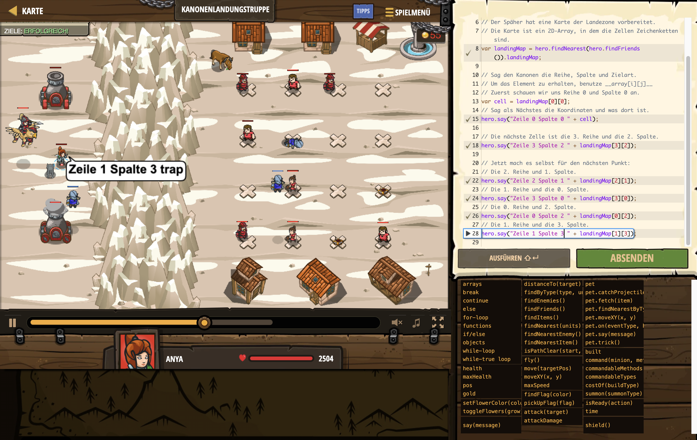

# Level Nummer: 23 - Cannon Landing Force



```js
// Wir sollten Soldaten schicken, um das Dorf zu verteidigen.
// Außerdem müssen wir alte Feuerfallen beseitigen.
// Für beide Ziele werden wir die Artillerie benutzen!
// Die Artillerie kann Soldaten und Fallenabwehr abfeuern.

// Der Späher hat eine Karte der Landezone vorbereitet.
// Die Karte ist ein 2D-Array, in dem die Zellen Zeichenketten sind.
var landingMap = hero.findNearest(hero.findFriends()).landingMap;

// Sag den Kanonen die Reihe, Spalte und Zielart.
// Um das Element zu erhalten, benutze __array[i][j]__
// Zuerst schauen wir uns Reihe 0 und Spalte 0 an.
var cell = landingMap[0][0];
// Sag als Nächstes die Koordinaten und was dort ist.
hero.say("Zeile 0 Spalte 0 " + cell);

// Die nächste Zelle ist die 3. Reihe und die 2. Spalte.
hero.say("Zeile 3 Spalte 2 " + landingMap[3][2]);

// Jetzt mach es selbst für den nächsten Punkt:
// Die 2. Reihe und 1. Spalte.
hero.say("Zeile 2 Spalte 1 " + landingMap[2][1]);
// Die 1. Reihe und die 0. Spalte.
hero.say("Zeile 3 Spalte 0 " + landingMap[3][0]);
// Die 0. Reihe und 2. Spalte.
hero.say("Zeile 0 Spalte 2 " + landingMap[0][2]);
// Die 1. Reihe und die 3. Spalte.
hero.say("Zeile 1 Spalte 3 " + landingMap[1][3]);

hero.say("Zeile 1 Spalte 0 " + landingMap[1][0]);
```