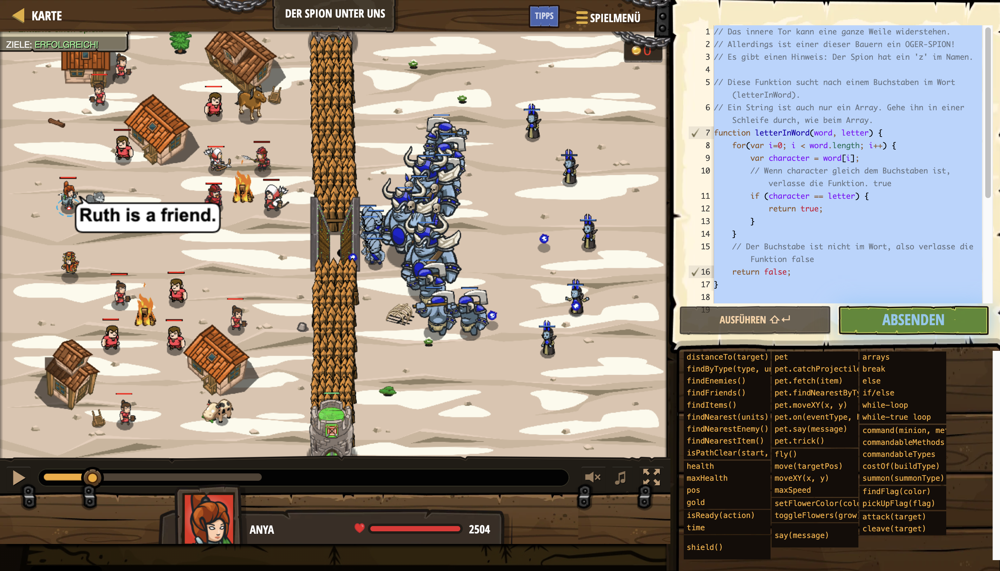

# Level Nummer: 16 - Der Spion unter uns



```js
// Das innere Tor kann eine ganze Weile widerstehen.
// Allerdings ist einer dieser Bauern ein OGER-SPION!
// Es gibt einen Hinweis: Der Spion hat ein 'z' im Namen.

// Diese Funktion sucht nach einem Buchstaben im Wort (letterInWord).
// Ein String ist auch nur ein Array. Gehe ihn in einer Schleife durch, wie beim Array.
function letterInWord(word, letter) {
    for(var i=0; i < word.length; i++) {
        var character = word[i];
        // Wenn character gleich dem Buchstaben ist, verlasse die Funktion. true
        if (character == letter) {
            return true;
        }
    }
    // Der Buchstabe ist nicht im Wort, also verlasse die Funktion false
    return false;
}

var spyLetter = "z";
var friends = hero.findFriends();

for (var j = 0; j < friends.length; j++) {
    var friendName = friends[j].id;
    if (letterInWord(friendName, spyLetter)) {
        // Enttarne den Spion!
        hero.say(friendName + " is a spy!!!");
    } else {
        hero.say(friendName + " is a friend.");
    }
}
```