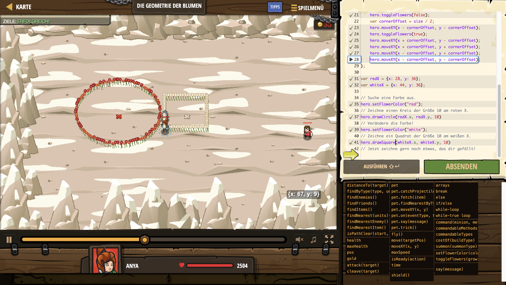

# Level Nummer: 12 - Die Geometrie der Blumen



```js
// Du besitzt nun den Ring der Blumen! Damit kannst du:
// toggleFlowers(true/false) - schaltet Blumen an oder aus.
// setFlowerColor("random") - kann auch "pink", "red", "blue", "purple", "yellow", oder "white" sein.

// Hier sind einige Funktionen um Formen zu zeichnen.
// x, y - Mitte der Form
// size - Größe der Form (Radius, Kantenlänge)
hero.drawCircle = function(x, y, size) {
    var angle = 0;
    hero.toggleFlowers(false);
    while (angle <= Math.PI * 2) {
        var newX = x + (size * Math.cos(angle));
        var newY = y + (size * Math.sin(angle));
        hero.moveXY(newX, newY);
        hero.toggleFlowers(true);
        angle += 0.2;
    }
};

hero.drawSquare = function(x, y, size) {
    hero.toggleFlowers(false);
    var cornerOffset = size / 2;
    hero.moveXY(x - cornerOffset, y - cornerOffset);
    hero.toggleFlowers(true);
    hero.moveXY(x + cornerOffset, y - cornerOffset);
    hero.moveXY(x + cornerOffset, y + cornerOffset);
    hero.moveXY(x - cornerOffset, y + cornerOffset);
    hero.moveXY(x - cornerOffset, y - cornerOffset);
};

var redX = {x: 28, y: 36};
var whiteX = {x: 44, y: 36};

// Suche eine Farbe aus.
hero.setFlowerColor("red");
// Zeichne einen Kreis der Größe 10 am roten X.
hero.drawCircle(redX.x, redX.y, 10)
// Verändere die Farbe!
hero.setFlowerColor("white");
// Zeichne ein Quadrat der Größe 10 am weißen X.
hero.drawSquare(whiteX.x, whiteX.y, 10)
// Jetzt zeichne gern noch etwas, das dir gefällt!
```