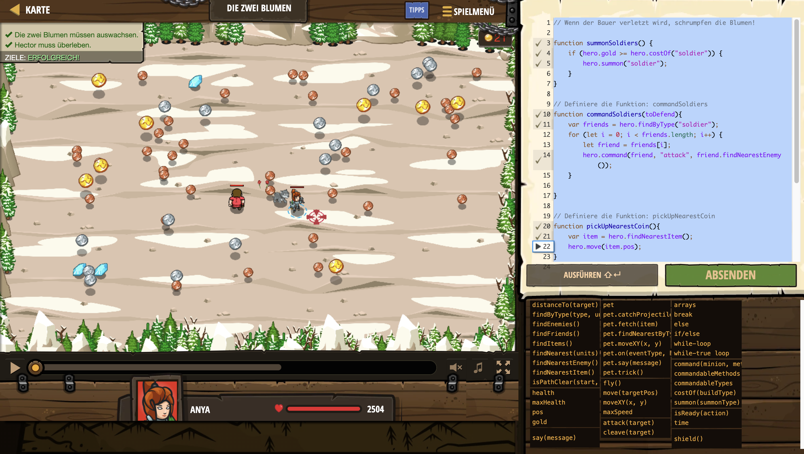

# Level Nummer: 11 - Die zwei Blumen



```js
// Wenn der Bauer verletzt wird, schrumpfen die Blumen!

function summonSoldiers() {
    if (hero.gold >= hero.costOf("soldier")) {
        hero.summon("soldier");
    }
}

// Definiere die Funktion: commandSoldiers
function commandSoldiers(toDefend){
    var friends = hero.findByType("soldier");
    for (let i = 0; i < friends.length; i++) {
        let friend = friends[i];
        hero.command(friend, "attack", friend.findNearestEnemy());
    }   

}

// Definiere die Funktion: pickUpNearestCoin
function pickUpNearestCoin(){
    var item = hero.findNearestItem();
    hero.move(item.pos);
}


var peasant = hero.findByType("peasant")[0];

while(true) {
    summonSoldiers();
    commandSoldiers(peasant);
    pickUpNearestCoin();
    
}
```