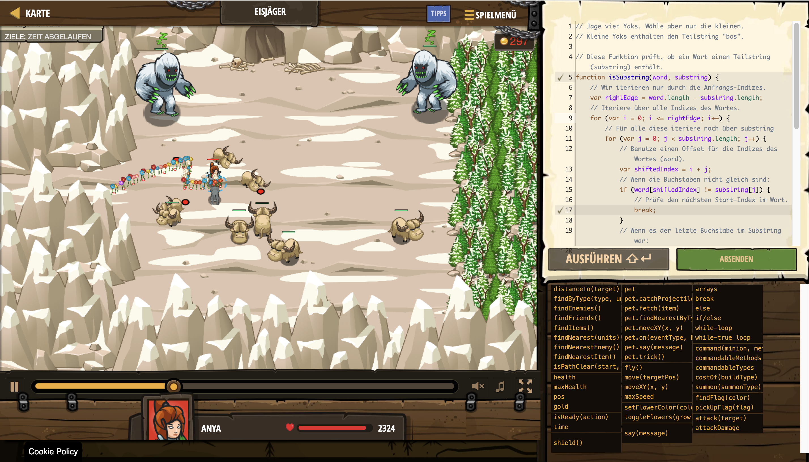

# Level Nummer: 17 - Eisjäger



```js
// Jage vier Yaks. Wähle aber nur die kleinen.
// Kleine Yaks enthalten den Teilstring "bos".

// Diese Funktion prüft, ob ein Wort einen Teilstring (substring) enthält.
function isSubstring(word, substring) {
    // Wir iterieren nur durch die Anfrangs-Indizes.
    var rightEdge = word.length - substring.length;
    // Iteriere über alle Indizes des Wortes.
    for (var i = 0; i <= rightEdge; i++) {
        // Für alle diese iteriere noch über substring
        for (var j = 0; j < substring.length; j++) {
            // Benutze einen Offset für die Indizes des Wortes (word).
            var shiftedIndex = i + j;
            // Wenn die Buchstaben nicht gleich sind:
            if (word[shiftedIndex] != substring[j]) {
                // Prüfe den nächsten Start-Index im Wort.
                break;
            }
            // Wenn es der letzte Buchstabe im Substring war:
            if (j == substring.length - 1) {
                // Dann ist der Substring das Wort.
                return true;
            }
        }
    }
    // Wir haben den substring nicht gefunden. 
    return false;
}

// Gehe über alle Feinde.
var enemies = hero.findEnemies();
for (var e = 0; e < enemies.length; e++) {
    var enemy = enemies[e];
    // Verwende die isSubstring-Funktion zum Überprüfen   

    if (isSubstring(enemy.id,"bos")) {
        while (enemy.health > 0) {
            hero.attack(enemy); 
        }
    }
}
```