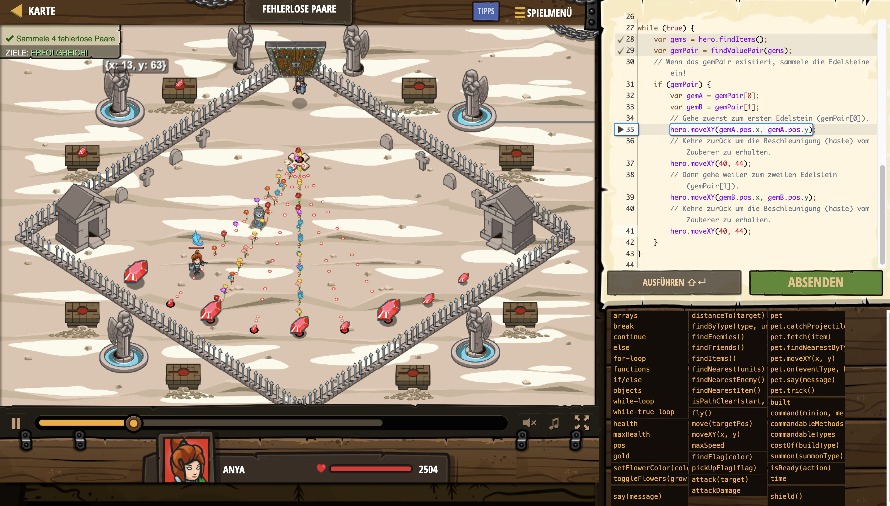

# Level Nummer: 21 - Fehlerlose Paare



```js
// Sammele 4 Paar Edelsteine.
// Jedes Paar muss aus gleichwertigen Edelsteinen bestehen.

// Diese Funktion (function) gibt zwei Items mit dem selben Wert zurück.
function findValuePair(items){
    // Überprüfe jedes mögliche Paar im array.
    // Iteriere Index 'i' von 0 bis zum vorletzten.
    for (var i = 0; i < items.length; i++) {
        var itemI = items[i];
        // Interiere Index 'j' von 'i+1' bis zum letzten.
        for (var j = 0; j < items.length; j++) {
            // Wenn es dasselbe Element ist, dann überspringe es.
            if (i == j) {
                continue;
            }
            var itemJ = items[j];
            // Wenn wir ein Paar mit zwei gleichen Edelsteinen finden, dann gib sie zurück.
            if (itemI.value === itemJ.value) {
                return [itemI, itemJ];
            }
        }
    }
    // Gib ein leeres array zurück wenn kein Paar existiert.
    return null;
}

while (true) {
    var gems = hero.findItems();
    var gemPair = findValuePair(gems);
    // Wenn das gemPair existiert, sammele die Edelsteine ein!
    if (gemPair) {
        var gemA = gemPair[0];
        var gemB = gemPair[1];
        // Gehe zuerst zum ersten Edelstein (gemPair[0]).
        hero.moveXY(gemA.pos.x, gemA.pos.y);
        // Kehre zurück um die Beschleunigung (haste) vom Zauberer zu erhalten.
        hero.moveXY(40, 44);
        // Dann gehe weiter zum zweiten Edelstein (gemPair[1]).
        hero.moveXY(gemB.pos.x, gemB.pos.y);
        // Kehre zurück um die Beschleunigung (haste) vom Zauberer zu erhalten.
        hero.moveXY(40, 44);
    }
}
```