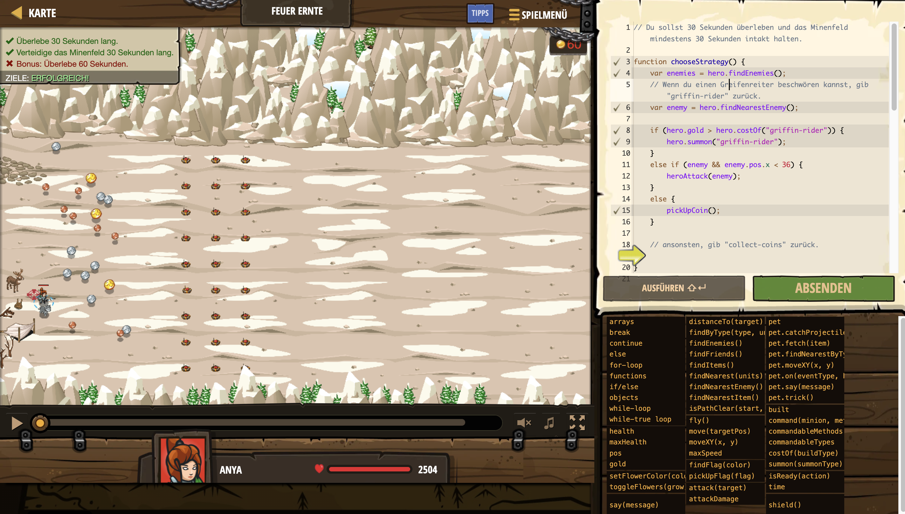

# Level Nummer: 26 - Feuer Ernte



```js
// Du sollst 30 Sekunden überleben und das Minenfeld mindestens 30 Sekunden intakt halten.

function chooseStrategy() {
    var enemies = hero.findEnemies();
    // Wenn du einen Greifenreiter beschwören kannst, gib "griffin-rider" zurück.
    var enemy = hero.findNearestEnemy();
    
    if (hero.gold > hero.costOf("griffin-rider")) {
        hero.summon("griffin-rider");
    }
    else if (enemy && enemy.pos.x < 36) {
        heroAttack(enemy);
    }
    else {
        pickUpCoin();
    }
    
    // ansonsten, gib "collect-coins" zurück.
    
}

function commandAttack() {
    // Befiehl deinen Greifen, die Oger anzugreifen.
    var army = hero.findByType("griffin-rider");
    
    for (let i = 0; i < army.length; i++) {
        var soldier = army[i];
        
        var munchkins = hero.findByType("munchkin");
        var scouts = hero.findByType("scout");
        var enemies = munchkins.concat(scouts)
        
        var target = soldier.findNearest(enemies);
        if (target) {
            hero.command(soldier, "attack", target);
        }
        
        
    }
    
}

function pickUpCoin() {
    // Münzen sammeln
    var item = hero.findNearestItem();  
    hero.move(item.pos);
}

function heroAttack(enemy) {
    // Greife die Fangrider an, die über das Minenfeld kommen
    hero.attack(enemy);
}

while(true) {
    commandAttack()
    chooseStrategy();
    
}
```