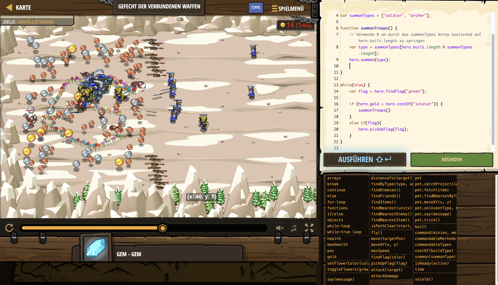

# Level Nummer: 25 - Gefecht der verbundenen Waffen



```js
// Versuche, modulo mit einem loop auf ein array anzuwenden.

// Wähle Zusammensetzung und Reihenfolge der Einheiten, indem du das Array befüllst.
var summonTypes = ["soldier", "archer"];

function summonTroops() {
    // Verwende % um durch das summonTypes Array basierend auf hero.built.length zu springen
    var type = summonTypes[hero.built.length % summonTypes.length];
    hero.summon(type);
}

while(true) {
    var flag = hero.findFlag("green");
    
    if (hero.gold > hero.costOf("archer")) {
        summonTroops() 
    }
    else if(flag){
        hero.pickUpFlag(flag);
    }
    
    var soldiers = hero.findByType("soldier");
    var archers = hero.findByType("archer");
    
    var army = soldiers.concat(archers)
    
    for (let i = 0; i < army.length; i++) {
        var soldier = army[i];
        var target = soldier.findNearestEnemy();
        hero.command(soldier, "attack", target);
    }      

}
```