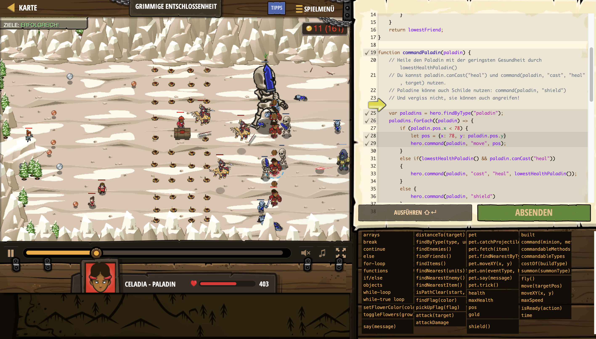

# Level Nummer: 28 - Grimmige Entschlossenheit



```js
// Dein Ziel ist Reynaldo zu schützen.

// Finde den Paladin mit der geringsten Gesundheit.
function lowestHealthPaladin() {
    var lowestHealth = 99999;
    var lowestFriend = null;
    var friends = hero.findFriends();
    for(var f=0; f < friends.length; f++) {
        var friend = friends[f];
        if(friend.type != "paladin") { continue; }
        if(friend.health < lowestHealth && friend.health < friend.maxHealth) {
            lowestHealth = friend.health;
            lowestFriend = friend;
        }
    }
    return lowestFriend;
}

function commandPaladin(paladin) {
    // Heile den Paladin mit der geringsten Gesundheit durch lowestHealthPaladin()
    // Du kannst paladin.canCast("heal") und command(paladin, "cast", "heal", target) nutzen.
    // Paladine könne auch Schilde nutzen: command(paladin, "shield")
    // Und vergiss nicht, sie können auch angreifen!
    
    var paladins = hero.findByType("paladin");
    paladins.forEach((paladin) => {
        if (paladin.pos.x < 78) {
            let pos = {x: 78, y: paladin.pos.y}
            hero.command(paladin, "move", pos);
        }
        else if(lowestHealthPaladin() && paladin.canCast("heal"))
        {
            hero.command(paladin, "cast", "heal", lowestHealthPaladin());
        }
        else {
            hero.command(paladin, "shield")
        }
    });
}

function commandFriends() {
    // Befehlige deine Freunde.
    var friends = hero.findFriends();
    for(var i=0; i < friends.length; i++) {
        var friend = friends[i];
        if(friend.type == "peasant") {
            commandPeasant(friend);
        } else if(friend.type == "griffin-rider") {
            commandGriffin(friend);
        } else if(friend.type == "paladin") {
            commandPaladin(friend);
        }
    }
}

function commandPeasant(friend)
{
    let item = friend.findNearestItem();
    hero.command(friend, "move", item.pos);
}

function commandGriffin(friend)
{
    let enemy = friend.findNearestEnemy();
    hero.command(friend, "attack", enemy);
}

while(true) {    
    commandFriends();
    // Rufe Greifreiter herbei!
    
    if (hero.gold > hero.costOf("griffin-rider")) {
        hero.summon("griffin-rider");
    }
}
```