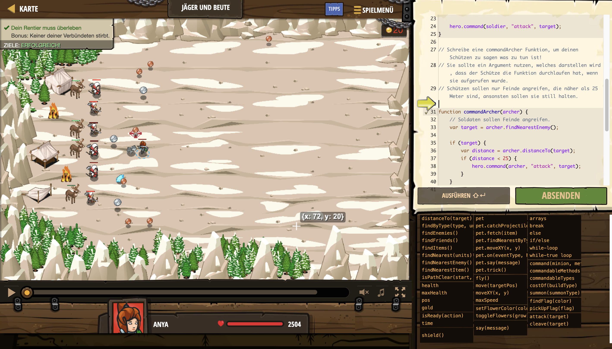

# Level Nummer: 14 - Jäger und Beute



```js
// Oger versuchen gerade dein Rentier zu töten!
// Halte deine Schützen zurück, während das Aufgebot der Soldaten angreift.

function pickUpCoin() {
    // Sammle Münzen.
    var item = hero.findNearestItem();
    hero.move(item.pos);
}

function summonTroops() {
    // Rufe Soldaten herbei, wenn du Gold hast.
    if (hero.gold > hero.costOf("soldier")) {
        hero.summon("soldier");
    }
}

// Diese Funktion hat ein Argument mit dem Namen "soldier".
// Argumente sind wie Variablen.
// Der Wert eines Arguments wird festgelegt, wenn die Funktion aufgerufen wird.
function commandSoldier(soldier) {
    // Soldaten sollen Feinde angreifen.
    var target = soldier.findNearestEnemy();
    
    hero.command(soldier, "attack", target);
}

// Schreibe eine commandArcher Funktion, um deinen Schützen zu sagen was zu tun ist!
// Sie sollte ein Argument nutzen, welches darstellen wird, dass der Schütze die Funktion durchlaufen hat, wenn sie aufgerufen wurde.
// Schützen sollen nur Feinde angreifen, die näher als 25 Meter sind, ansonsten sollen sie still halten.

function commandArcher(archer) {
    // Soldaten sollen Feinde angreifen.
    var target = archer.findNearestEnemy();

    if (target) {
        var distance = archer.distanceTo(target);
        if (distance < 25) {
            hero.command(archer, "attack", target);
        }
    }
    
    
}
while(true) {
    pickUpCoin();
    summonTroops();
    var friends = hero.findFriends();
    for(var i=0; i < friends.length; i++) {
        var friend = friends[i];
        if(friend.type == "soldier") {
            // Dieser Freund wird zu den unterschiedlichen Soldaten in commandSoldier zugeordnet.
            commandSoldier(friend);
        } else if(friend.type == "archer") {
            // Achte darauf, deine Bogenschützen zu befehligen.
            commandArcher(friend);
        }
    }
}
```