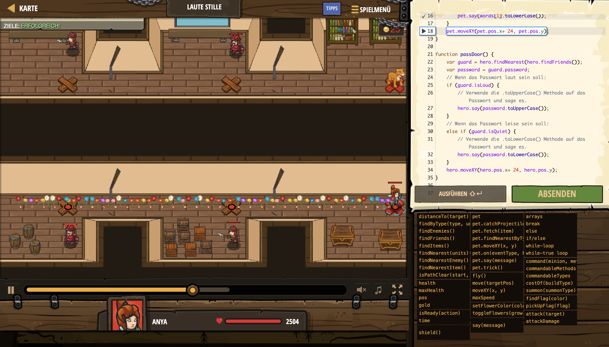

# Level Nummer: 19 - Laute Stille



```js
// Bewege den Held und seinen Begleiter zu den Ausgängen.

function onHear(event) {
    // Erhalte die Lautstärke und das Passwort.
    var words = event.message.split(" ");
    var volume = words[0];
    var password = words[1];
    // Wenn das Passwort laut sein soll:
    if (volume == "Loud") {
        // Dein Begleiter wiederholt es in GROßSCHIRFT.
        pet.say(words[1].toUpperCase());
    }
    // Wenn das Passwort leise sein soll:
    if (volume == "Quiet") {
        // Dein Begleiter wiederholt es in kleinschrift.
        pet.say(words[1].toLowerCase());
    }
    pet.moveXY(pet.pos.x+ 24, pet.pos.y);
}

function passDoor() {
    var guard = hero.findNearest(hero.findFriends());
    var password = guard.password;
    // Wenn das Passwort laut sein soll:
    if (guard.isLoud) {
        // Verwende die .toUpperCase() Methode auf das Passwort und sage es.
        hero.say(password.toUpperCase());
    }
    // Wenn das Passwort leise sein soll:
    else if (guard.isQuiet) {
        // Verwende die .toLowerCase() Methode auf das Passwort und sage es.
        hero.say(password.toLowerCase());
    }
    hero.moveXY(hero.pos.x+ 24, hero.pos.y);
}

// Erlaube es deinem Begleiter, die Wachen zu hören.
pet.on("hear", onHear);
// Der Code für den Held um die Tür zu durchqueren.
hero.moveXY(10, 14);
passDoor();
passDoor();
```