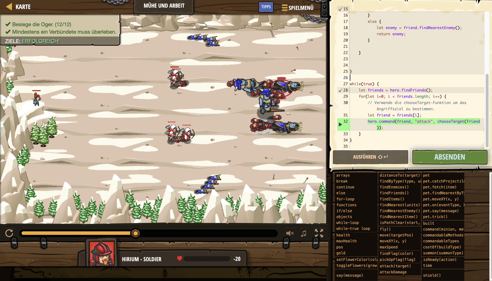

# Level Nummer: 27 - Mühe und Arbeit



```js
function chooseTarget(friend)
{
    if (friend.type == "archer") {
        let enemy = friend.findNearestEnemy();
        return enemy;
    }
    else {
        let witches = hero.findByType("witch");
        if (witches.length > 0) {
            return friend.findNearest(witches);
        }
        else {
            let enemy = friend.findNearestEnemy();
            return enemy;
        }
        
    }
    
    
}

while(true) {
    let friends = hero.findFriends();
    for(let i=0; i < friends.length; i++) {
        // Verwende die chooseTarget-Funktion um das Angriffsziel zu bestimmen.
        let friend = friends[i];
        hero.command(friend, "attack", chooseTarget(friend));
    }
}
```