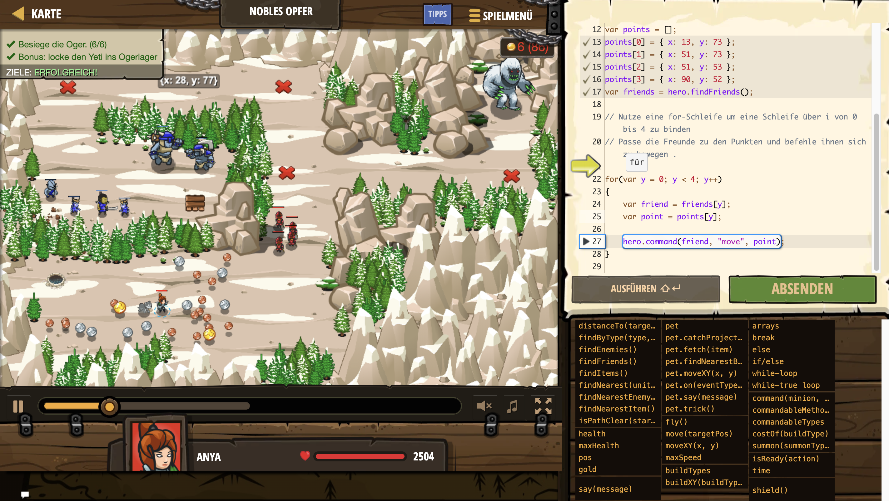

# Level Nummer: 8 - Nobles Opfer



```js
// Sammle 80 Gold.
while (hero.gold < 80) {
    var item = hero.findNearestItem();
    hero.move(item.pos);
}
// Baue 4 Soldaten als Köder.
for(var x = 0; x < 4; x++)
{
    hero.summon("soldier");
}
// Bringe deine Soldaten in Position.
var points = [];
points[0] = { x: 13, y: 73 };
points[1] = { x: 51, y: 73 };
points[2] = { x: 51, y: 53 };
points[3] = { x: 90, y: 52 };
var friends = hero.findFriends();

// Nutze eine for-Schleife um eine Schleife über i von 0 bis 4 zu binden
// Passe die Freunde zu den Punkten und befehle ihnen sich zu bewegen .

for(var y = 0; y < 4; y++)
{
    var friend = friends[y];
    var point = points[y];
    
    hero.command(friend, "move", point);
}
```