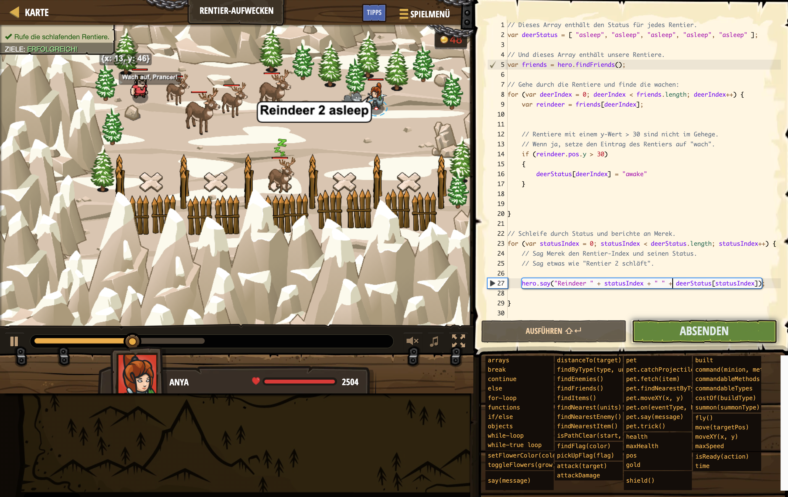

# Level Nummer: 22 - Reindeer Wakeup



```js
// Dieses Array enthält den Status für jedes Rentier.
var deerStatus = [ "asleep", "asleep", "asleep", "asleep", "asleep" ];

// Und dieses Array enthält unsere Rentiere.
var friends = hero.findFriends();

// Gehe durch die Rentiere und finde die wachen:
for (var deerIndex = 0; deerIndex < friends.length; deerIndex++) {
    var reindeer = friends[deerIndex];
    
    
    // Rentiere mit einem y-Wert > 30 sind nicht im Gehege.
    // Wenn ja, setze den Eintrag des Rentiers auf "wach".
    if (reindeer.pos.y > 30) 
    {
        deerStatus[deerIndex] = "awake"
    }
    

}

// Schleife durch Status und berichte an Merek.
for (var statusIndex = 0; statusIndex < deerStatus.length; statusIndex++) {
    // Sag Merek den Rentier-Index und seinen Status.
    // Sag etwas wie "Rentier 2 schläft".
    
    hero.say("Reindeer " + statusIndex + " " + deerStatus[statusIndex]);

}
```