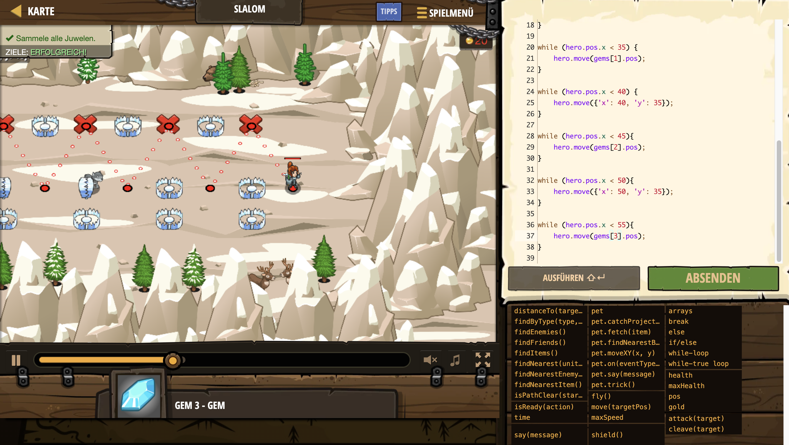

# Level Nummer: 2 - Slalom



```js
// Benutze Objekt-Literale um den sicheren Pfad zu gehen und die Juwelen einzusammeln.
// Du kannst moveXY() in diesem Level nichgt benutzen! Benutze move(), um dich zu bewegen.
var gems = hero.findItems();

while (hero.pos.x < 20) {
	// move() akzeptiert Objekte mit x und y Eigenschaften, Zahlen reichen nicht.
	hero.move({'x': 20, 'y': 35});
}

while (hero.pos.x < 25) {
	// Die Position eines Edelsteins ist ein Objekt mit x- und y- Eigenschaften.
	var gem0 = gems[0];
	hero.move(gem0.pos);
}

while (hero.pos.x < 30) {
	hero.move({'x': 30, 'y': 35});
}

while (hero.pos.x < 35) {
	hero.move(gems[1].pos);
}

while (hero.pos.x < 40) {
	hero.move({'x': 40, 'y': 35});
}

while (hero.pos.x < 45){
	hero.move(gems[2].pos);
}

while (hero.pos.x < 50){
	hero.move({'x': 50, 'y': 35});
}

while (hero.pos.x < 55){
	hero.move(gems[3].pos);
}

```