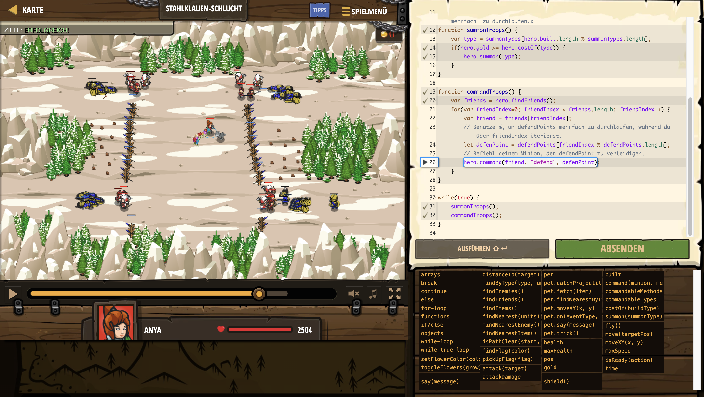

# Level Nummer: 24 - Stahlklauen-Schlucht



```js
// Dieses Level führt den % Operator ein, auch Modulo genannt.
// a % b liefert den Rest von a dividiert durch b.
// Dies kann benutzt werden, um wieder zum Anfang eines Arrays zurückzuspringen, wenn ein Index größer als die Länge würde

var defendPoints = [{"x": 35, "y": 63},{"x": 61, "y": 63},{"x": 32, "y": 26},{"x": 64, "y": 26}];

var summonTypes = ["soldier","soldier","soldier","soldier","archer","archer","archer","archer"];

// Du fängst mit 360 Gold an, um Soldaten und Bogenschützen zu rektutieren.
// hero.built ist ein Array mit allen je rekrutierten Soldaten.
// Hier nutzen wir hero.built.length % summonTypes.length, um um summonTypes mehrfach  zu durchlaufen.x
function summonTroops() {
    var type = summonTypes[hero.built.length % summonTypes.length];
    if(hero.gold >= hero.costOf(type)) {
        hero.summon(type);
    }
}

function commandTroops() {
    var friends = hero.findFriends();
    for(var friendIndex=0; friendIndex < friends.length; friendIndex++) {
        var friend = friends[friendIndex];
        // Benutze %, um defendPoints mehrfach zu durchlaufen, während du über friendIndex iterierst.
        let defenPoint = defendPoints[friendIndex % defendPoints.length];
        // Befiehl deinem Minion, den defendPoint zu verteidigen.
        hero.command(friend, "defend", defenPoint);
    }
}

while(true) {
    summonTroops();
    commandTroops();
}
```