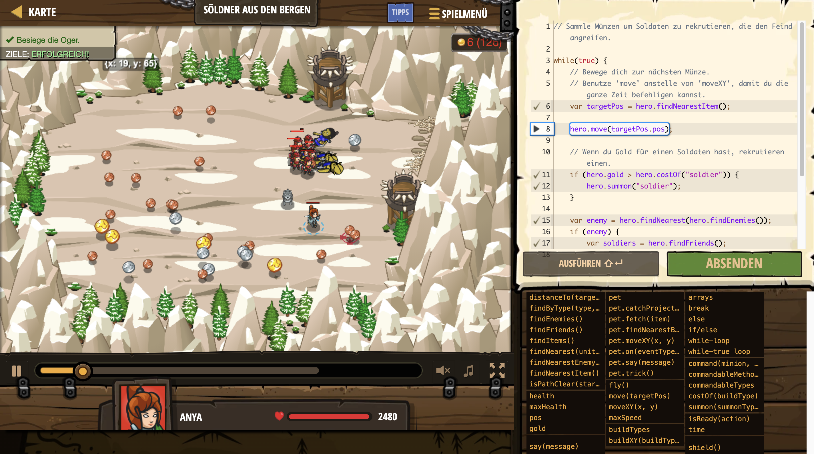

# Level Nummer: 5 - Söldner aus den Bergen



```js
// Sammle Münzen um Soldaten zu rekrutieren, die den Feind angreifen.

while(true) {
    // Bewege dich zur nächsten Münze.
    // Benutze 'move' anstelle von 'moveXY', damit du die ganze Zeit befehligen kannst.
    var targetPos = hero.findNearestItem();
    
    hero.move(targetPos.pos);
    
    // Wenn du Gold für einen Soldaten hast, rekrutieren einen.
    if (hero.gold > hero.costOf("soldier")) {
        hero.summon("soldier");
    }
    
    var enemy = hero.findNearest(hero.findEnemies());
    if (enemy) {
        var soldiers = hero.findFriends();
        var soldierIndex = 0;
        while(soldierIndex < soldiers.length) {
             var soldier = soldiers[soldierIndex];
             hero.command(soldier, "attack", enemy);
             soldierIndex++;
        }
    }
}
```