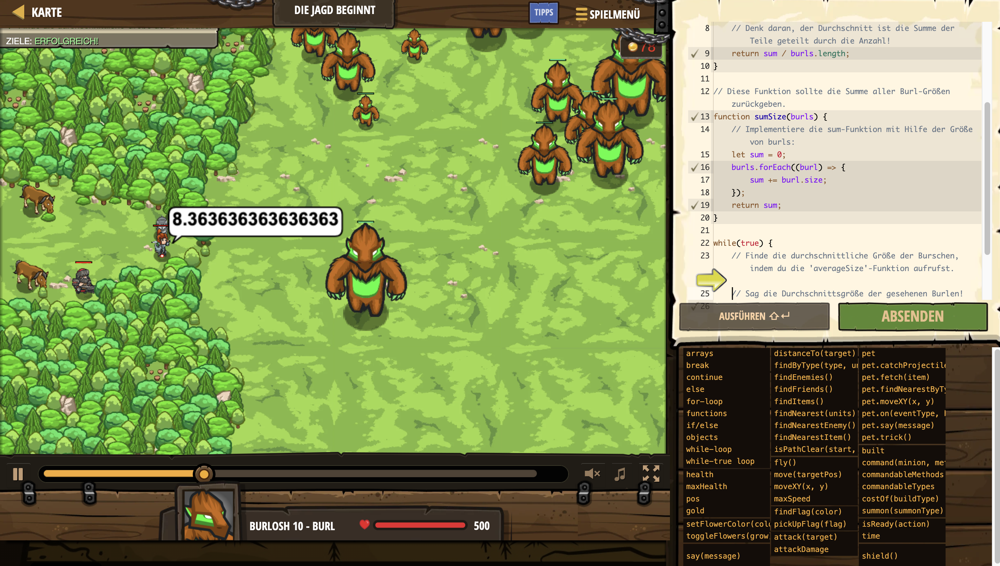

# Level Nummer: 29 - The Hunt Begins



```js
// Senick versucht, den schwer fassbaren Burleous Majoris zu finden!
// Aber er weiß nicht, wie groß ein Burleous Majoris sein würde...
// Finde die durchschnittliche Größe dieser Burl-Population, um sie als Basislinie zu verwenden!

// Diese Funktion gibt die durchschnittliche Größe aller Burls in einem Array zurück.
function averageSize(burls) {
    var sum = sumSize(burls);
    // Denk daran, der Durchschnitt ist die Summe der Teile geteilt durch die Anzahl!  
    return sum / burls.length;
}

// Diese Funktion sollte die Summe aller Burl-Größen zurückgeben.
function sumSize(burls) {
    // Implementiere die sum-Funktion mit Hilfe der Größe von burls:
    let sum = 0;
    burls.forEach((burl) => {
        sum += burl.size;
    });
    return sum;
}

while(true) {
    // Finde die durchschnittliche Größe der Burschen, indem du die 'averageSize'-Funktion aufrufst.
    
    // Sag die Durchschnittsgröße der gesehenen Burlen!
    var targets = hero.findByType("burl");
    
    hero.say(averageSize(targets));

}
```