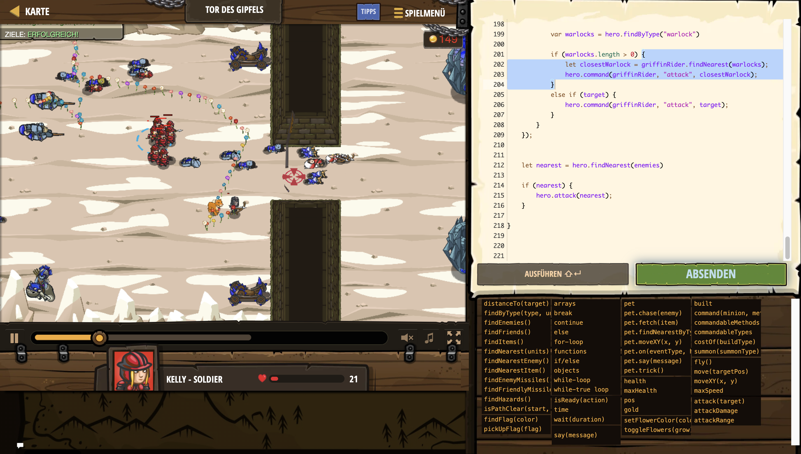

# Level Nummer: 31 - Tor des Gipfels



```js
function lowestHealthPaladin() {
    var lowestHealth = 99999;
    var lowestFriend = null;
    var friends = hero.findFriends();
    for(var f=0; f < friends.length; f++) {
        var friend = friends[f];
        if(friend.health < lowestHealth && friend.health < friend.maxHealth) {
            lowestHealth = friend.health;
            lowestFriend = friend;
        }
    }
    return lowestFriend;
}


var stage2 = false;

while (true) {
    // Friendlies
    var soldiers = hero.findByType("soldier");
    var archers = hero.findByType("archer");
    var paladins = hero.findByType("paladin");

    //Enemies
    var fangriders = hero.findByType("fangrider");
    var catapults = hero.findByType("catapult");
    
    soldiers.forEach((soldier) => {
        let target = null;
        if (catapults.length > 0) {
            target = hero.findNearest(catapults);
        }
        else {
            target = soldier.findNearestEnemy();
        }

        if (target) {
            hero.command(soldier, "attack", target);
        }

    });

    archers.forEach((archer) => {
        let target = archer.findNearestEnemy();
        if (target) {
            hero.command(archer, "attack", target);
        }
    });


    // Hero Fight Logic

    let target = null;

    if (catapults.length > 0) {
        target = hero.findNearest(catapults);
    }
    else if (fangriders.length > 0) {
        target = hero.findNearest(fangriders);
    }
    else {
        target = hero.findNearestEnemy();
    }

    if (target) {
        hero.attack(target);
    }
    
    var enemies = hero.findEnemies();
    enemies.forEach((enemy) => {
        if (enemy.type == "tower") {
            stage2 = true;
        }
    });

    if (stage2) {
        break;
    }
}


while (true) {
    
    var archers = hero.findByType("archer");
    var soldiers = hero.findByType("soldier");
    
    archers.forEach((archer) => {
        let archerTarget = archer.findNearestEnemy();
        if (archerTarget) {
            hero.command(archer, "attack", archerTarget);
        }
    });
    
    var enemies = hero.findEnemies();
    
    if (enemies.length == 4) {
        while (hero.pos.x < 84) {
            hero.moveXY(85, 50);
        }
        hero.attack("Beam Tower");
    }
    
    if (enemies.length == 3) {
        while (hero.pos.y > 30) {
            hero.moveXY(85, 21);
        }
        hero.attack("Beam Tower 1");
    }
    
    if (enemies.length == 2) {
        
        
        soldiers.forEach((soldier) => {
            let target = soldier.findNearestEnemy();

            if (target) {
                hero.command(soldier, "attack", target);
            }

        });
        
        var enemy = hero.findNearestEnemy();
        hero.attack(enemy);
    }
    
    if (enemies.length == 1) {
        break;
    }
}

while(true) {
    
    var paladins = hero.findByType("paladin");
    var soldiers = hero.findByType("soldier");
    var griffinRiders = hero.findByType("griffin-rider");
    
    while(hero.pos.x < 247) {
        hero.moveXY(249, 35);
    }
    
    while (hero.gold > hero.costOf("griffin-rider")) {
        hero.summon("griffin-rider");
    }
    
    soldiers.forEach((soldier) => {
        
        if (soldier.team == "humans") {
            if (!soldier.gotInstructions) {
                soldier.gotInstructions = true;
                hero.command(soldier, "move", {x:273, y:34});
            }
        
            let target = soldier.findNearestEnemy();
            
            var warlocks = hero.findByType("warlock")
            
            if (warlocks.length > 0) {
                let closestWarlock = soldier.findNearest(warlocks);
                hero.command(soldier, "attack", closestWarlock);
            }
            else if (target) {
                hero.command(soldier, "attack", target);
            }
        }

    });
    
    var skeletons = hero.findByType("skeleton");
    
    let enemies = hero.findEnemies();
    
      
    for (let i = 0; i < enemies.length; i++) {
        if (enemies[i].type == "door") {
            enemies.splice(i,1);
        }
    }
    
    archers.forEach((archer) => {
        let target = archer.findNearest(enemies);
        if (target) {
            hero.command(archer, "attack", target);
        }
    });
    
    paladins.forEach((paladin) => {
        
        if (!paladin.gotInstructions) {
            paladin.gotInstructions = true;
            hero.command(paladin, "move", {x:228, y:24});
        }
    });
    
    griffinRiders.forEach((griffinRider) => {
        if (griffinRider.team == "humans") {
            let target = griffinRider.findNearest(enemies);
            
            var warlocks = hero.findByType("warlock")
            
            if (warlocks.length > 0) {
                let closestWarlock = griffinRider.findNearest(warlocks);
                hero.command(griffinRider, "attack", closestWarlock);
            }
            else if (target) {
                hero.command(griffinRider, "attack", target);
            }
        }
    });
    
    
    let nearest = hero.findNearest(enemies)
    
    if (nearest) {
        hero.attack(nearest);
    }
    
}
```