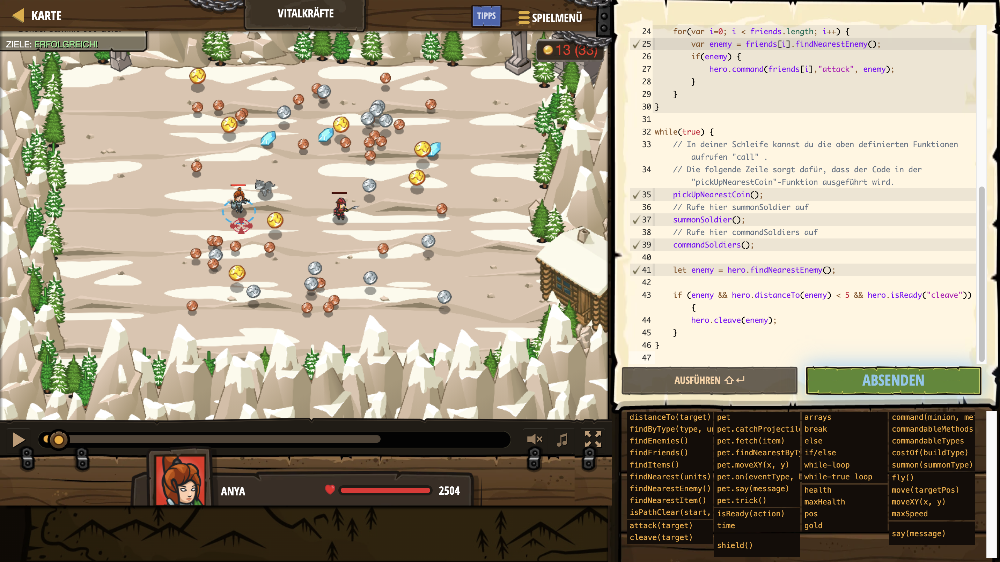

# Level Nummer: 10 - Vitalkräfte



```js
// Dieses Level zeigt wie du eigene Funktionen definieren kannst.
// Der Code innerhalb der Funktion wird nicht sofort ausgeführt. Er wird später aufgerufen.
// Diese Funktion lässt deinen Held die nächste Münze sammeln.
function pickUpNearestCoin() {
    var items = hero.findItems();
    var nearestCoin = hero.findNearest(items);
    if(nearestCoin) {
        hero.move(nearestCoin.pos);
    }
}

// Diese Funktion lässt deinen Helden einen Soldaten herbeirufen.
function summonSoldier() {
    // Wenn hero.gold größer ist als die Kosten des "soldier":
    if (hero.gold > hero.costOf("soldier")) {
        // Dann ruf einen "Soldaten":
        hero.summon("soldier");
    }  
}

// Diese Funktion lässt deine Soldaten den nächsten Feind angreifen.
function commandSoldiers() {
    var friends = hero.findFriends();
    for(var i=0; i < friends.length; i++) {
        var enemy = friends[i].findNearestEnemy();
        if(enemy) {
            hero.command(friends[i],"attack", enemy);
        }
    }
}

while(true) {
    // In deiner Schleife kannst du die oben definierten Funktionen aufrufen "call" .
    // Die folgende Zeile sorgt dafür, dass der Code in der "pickUpNearestCoin"-Funktion ausgeführt wird.
    pickUpNearestCoin();
    // Rufe hier summonSoldier auf
    summonSoldier();
    // Rufe hier commandSoldiers auf
    commandSoldiers();
    
    let enemy = hero.findNearestEnemy();
    
    if (enemy && hero.distanceTo(enemy) < 5 && hero.isReady("cleave")) {
        hero.cleave(enemy);
    }
}
```