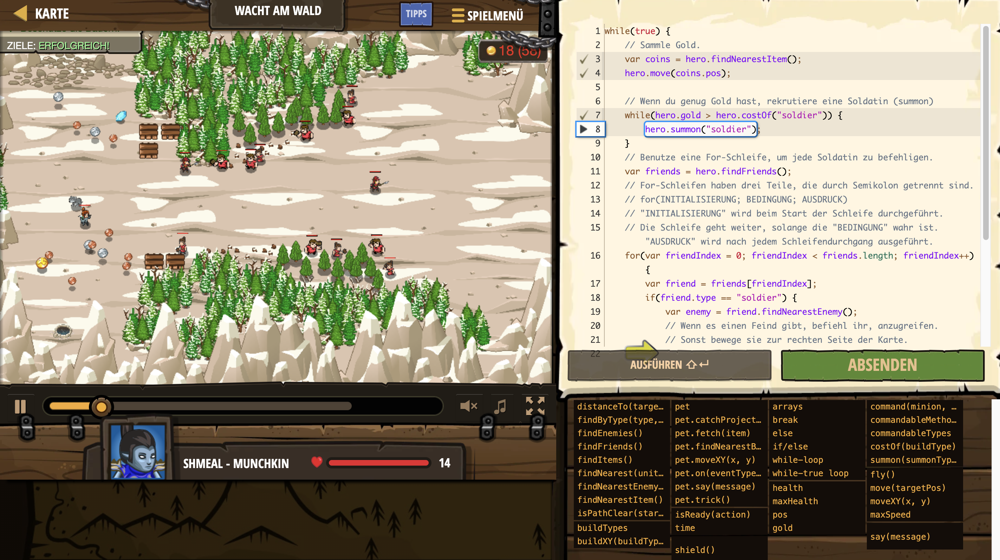

# Level Nummer: 6 - Wacht am Wald



```js
while(true) {
    // Sammle Gold.
    var coins = hero.findNearestItem();
    hero.move(coins.pos);
    
    // Wenn du genug Gold hast, rekrutiere eine Soldatin (summon)
    while(hero.gold > hero.costOf("soldier")) {
        hero.summon("soldier");
    }
    // Benutze eine For-Schleife, um jede Soldatin zu befehligen.
    var friends = hero.findFriends();
    // For-Schleifen haben drei Teile, die durch Semikolon getrennt sind.
    // for(INITIALISIERUNG; BEDINGUNG; AUSDRUCK)
    // "INITIALISIERUNG" wird beim Start der Schleife durchgeführt.
    // Die Schleife geht weiter, solange die "BEDINGUNG" wahr ist. "AUSDRUCK" wird nach jedem Schleifendurchgang ausgeführt.
    for(var friendIndex = 0; friendIndex < friends.length; friendIndex++) {
        var friend = friends[friendIndex];
        if(friend.type == "soldier") {
            var enemy = friend.findNearestEnemy();
            // Wenn es einen Feind gibt, befiehl ihr, anzugreifen.
            // Sonst bewege sie zur rechten Seite der Karte.
            
            if (enemy) {
                hero.command(friend, "attack", enemy);
            }
            else {
                hero.command(friend, "move", {x:85, y:46});
            }
        }
    }
}
```