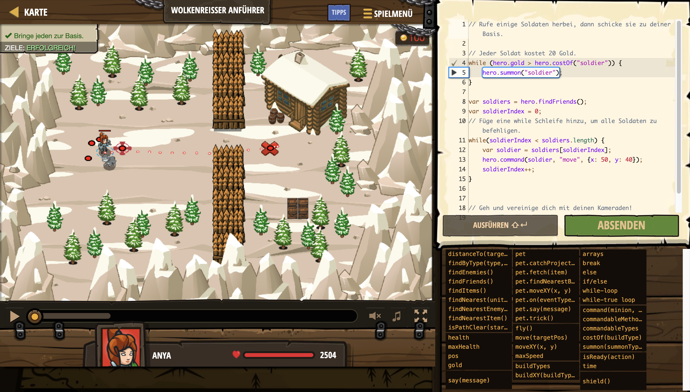

# Level Nummer: 4 - Wolkenreißer Anführer



```js
// Rufe einige Soldaten herbei, dann schicke sie zu deiner Basis.

// Jeder Soldat kostet 20 Gold.
while (hero.gold > hero.costOf("soldier")) {
    hero.summon("soldier");
}
    
var soldiers = hero.findFriends();
var soldierIndex = 0;
// Füge eine while Schleife hinzu, um alle Soldaten zu befehligen.
while(soldierIndex < soldiers.length) {
    var soldier = soldiers[soldierIndex];
    hero.command(soldier, "move", {x: 50, y: 40});
    soldierIndex++;
}


// Geh und vereinige dich mit deinen Kameraden!
hero.moveXY(51, 41);
```