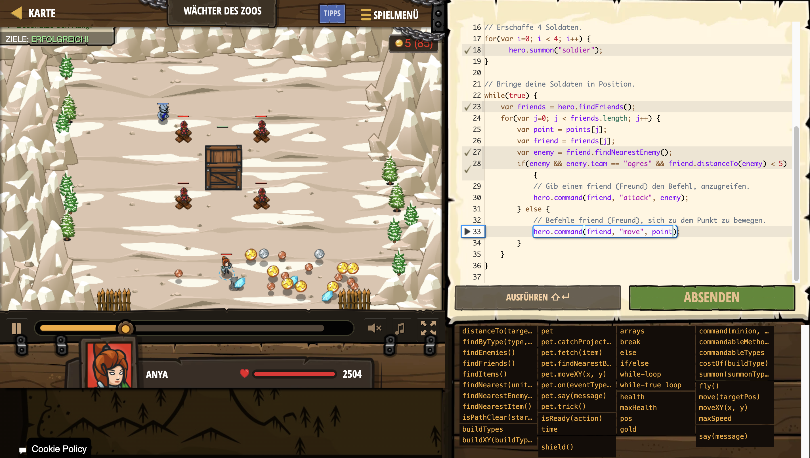

# Level Nummer: 7 - Wächter des Zoos



```js
// Beschütze den Käfig.
// Platziere einen Soldaten auf jedem X.
var points = [];
points[0] = {x: 33, y: 42};
points[1] = {x: 47, y: 42};
points[2] = {x: 33, y: 26};
points[3] = {x: 47, y: 26};

// Sammle 80 Gold.
while(hero.gold < 80)
{
    var item = hero.findNearestItem();
    hero.move(item.pos);
}

// Erschaffe 4 Soldaten.
for(var i=0; i < 4; i++) {
      hero.summon("soldier");
}

// Bringe deine Soldaten in Position.
while(true) {
    var friends = hero.findFriends();
    for(var j=0; j < friends.length; j++) {
        var point = points[j];
        var friend = friends[j];
        var enemy = friend.findNearestEnemy();
        if(enemy && enemy.team == "ogres" && friend.distanceTo(enemy) < 5) {
            // Gib einem friend (Freund) den Befehl, anzugreifen.
            hero.command(friend, "attack", enemy);
        } else {
            // Befehle friend (Freund), sich zu dem Punkt zu bewegen.
            hero.command(friend, "move", point);
        }
    }
}

```